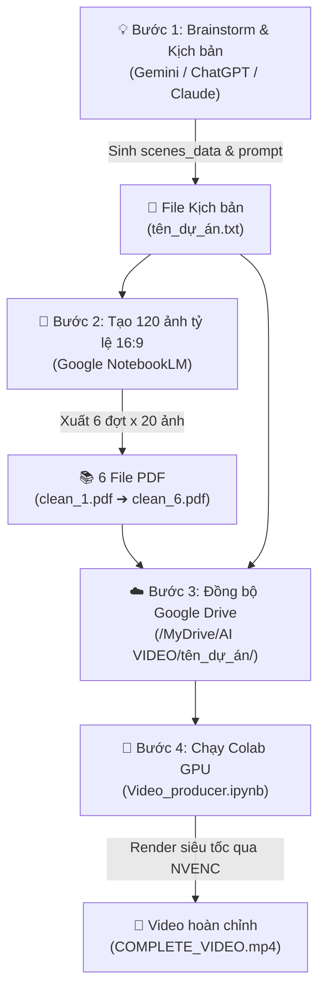

# 🎬 AI Video Producer - Quy Trình Sản Xuất Video Tự Động Từ A-Z

Hệ thống tự động hóa sản xuất video ngắn/dài cho YouTube từ ý tưởng đến video thành phẩm Full HD 1080p, kết hợp sức mạnh của **LLM (ChatGPT/Claude/Gemini)** ➔ **NotebookLM (Tạo ảnh hàng loạt)** ➔ **Google Drive** ➔ **Google Colab (Tăng tốc GPU NVENC)**.

---

## 📌 Sơ Đồ Quy Trình Tổng Quan (Pipeline)



---

## 📂 Cấu Trúc Thư Mục Chuẩn Trên Google Drive

Toàn bộ code trong [`Video_producer.ipynb`](./Video_producer.ipynb) được thiết kế để tự động quét và xuất file theo cây thư mục gốc tại `Google Drive của tôi (MyDrive) / AI VIDEO`:

```text
MyDrive/
└── AI VIDEO/
    │
    ├── material/                                 <-- Thư mục tài nguyên chung
    │   └── theend.mp4                            <-- Video outro/kết thúc (tùy chọn)
    │
    └── <SUB_FOLDER_NAME>/                        <-- Thư mục dự án (Ví dụ: lion_social)
        │
        ├── <SUB_FOLDER_NAME>.txt                 <-- Kịch bản chứa JSON 120 scenes (lion_social.txt)
        │
        ├── image/                                <-- [BẮT BUỘC] Chứa 6 file PDF từ NotebookLM
        │   ├── clean_1.pdf                       <-- 20 ảnh cho Scenes 1 - 20
        │   ├── clean_2.pdf                       <-- 20 ảnh cho Scenes 21 - 40
        │   ├── clean_3.pdf                       <-- 20 ảnh cho Scenes 41 - 60
        │   ├── clean_4.pdf                       <-- 20 ảnh cho Scenes 61 - 80
        │   ├── clean_5.pdf                       <-- 20 ảnh cho Scenes 81 - 100
        │   └── clean_6.pdf                       <-- 20 ảnh cho Scenes 101 - 120
        │
        │── [CÁC THƯ MỤC TỰ ĐỘNG SINH RA KHI CHẠY CODE - KHÔNG CẦN TẠO TAY]:
        │
        ├── clean_image/                          <-- Tự giải nén ra 1.jpg, 2.jpg... 120.jpg
        ├── audio/                                <-- Tự lưu full_narration_audio.mp3 & scenes_timed.json
        └── video/                                <-- Chứa video kết xuất: COMPLETE_VIDEO.mp4
```

> [!NOTE]
> Các thư mục `clean_image/`, `audio/`, và `video/` sẽ **tự động được tạo** bởi code Python trong quá trình xử lý, bạn không cần phải tạo thủ công.

---

## 📝 Chi Tiết 4 Bước Thực Hiện

### Bước 1: Tạo kịch bản & Prompt 120 cảnh
1. Mở một trong các công cụ AI: **ChatGPT**, **Claude**, hoặc **Gemini**.
2. Sao chép nội dung từ file mẫu: [`content&image_generator_prompt.txt`](./content&image_generator_prompt.txt).
3. Điền chủ đề bạn muốn sản xuất vào dòng cuối cùng:
   ```text
   === [ĐIỀN Ý TƯỞNG / CHỦ ĐỀ CỦA BẠN VÀO ĐÂY] ===
   ```
4. AI sẽ xuất ra cấu trúc chuẩn gồm:
   * **Thông tin video:** Tiêu đề tiếng Anh, mô tả tiếng Việt và thẻ hashtags.
   * **Biến cấu hình:** `SUB_FOLDER_NAME = "tên_dự_án"` (viết liền không dấu, ví dụ: `lion_social`).
   * **Dữ liệu phân cảnh:** `scenes_data = """[...]"""` (chuỗi JSON gồm 120 scenes với `script_en` và `image_generation_prompt`).
5. Lưu toàn bộ kết quả vào một file text đặt tên là: `<SUB_FOLDER_NAME>.txt` (ví dụ: `lion_social.txt`).

---

### Bước 2: Tạo 120 ảnh tỷ lệ 16:9 bằng NotebookLM
1. Truy cập [Google NotebookLM](https://notebooklm.google.com/) và tạo một cuốn sổ mới.
2. Tải file `<SUB_FOLDER_NAME>.txt` lên làm **Tài liệu nguồn (Source)**.
3. Mở file hướng dẫn: [`prompt_notebooklm.txt`](./prompt_notebooklm.txt).
4. Gửi lần lượt 6 lệnh tạo ảnh (mỗi lệnh chia nhỏ 20 scenes để đảm bảo AI sinh đủ 100% ảnh, không bị nuốt cảnh):

| Đợt | Khoảng Scenes | Tên file PDF xuất ra khi tải về |
|:---:|:---:|:---|
| **1** | Scenes 1 – 20 | `clean_1.pdf` |
| **2** | Scenes 21 – 40 | `clean_2.pdf` |
| **3** | Scenes 41 – 60 | `clean_3.pdf` |
| **4** | Scenes 61 – 80 | `clean_4.pdf` |
| **5** | Scenes 81 – 100 | `clean_5.pdf` |
| **6** | Scenes 101 – 120 | `clean_6.pdf` |

> [!IMPORTANT]
> Tên file PDF bắt buộc phải đặt chính xác theo định dạng: `clean_1.pdf`, `clean_2.pdf`, ..., `clean_6.pdf` (chữ thường, dấu gạch dưới).

---

### Bước 3: Đưa file lên Google Drive
1. Mở **Google Drive**, tạo thư mục gốc: `AI VIDEO`.
2. *(Tùy chọn)* Tạo thư mục `AI VIDEO/material/` và tải file video kết thúc `theend.mp4` vào đây.
3. Tạo thư mục con cho dự án trùng khớp với `SUB_FOLDER_NAME` (ví dụ: `AI VIDEO/lion_social/`).
4. Tải các file vào đúng vị trí:
   * File kịch bản: `AI VIDEO/lion_social/lion_social.txt`.
   * Tạo thư mục `image` bên trong: `AI VIDEO/lion_social/image/`.
   * Tải đủ 6 file PDF vào `image/` (`clean_1.pdf` đến `clean_6.pdf`).

---

### Bước 4: Chạy Notebook trên Google Colab (Tăng tốc GPU)
1. Tải file [`Video_producer.ipynb`](./Video_producer.ipynb) lên Google Colab.
2. **Kích hoạt GPU T4 (Bắt buộc để render siêu tốc):**
   * Trên thanh menu: chọn **Runtime (Thời gian chạy)** ➔ **Change runtime type (Thay đổi loại thời gian chạy)**.
   * Tại **Hardware accelerator (Bộ tăng tốc phần cứng)**: Chọn **T4 GPU** ➔ bấm **Save (Lưu)**.
3. **Cấu hình đường dẫn tại Cell 2:**
   Chỉ cần đổi 2 dòng đầu cho khớp với tên thư mục dự án của bạn:
   ```python
   SUB_FOLDER_NAME = "lion_social"
   script_file_path = "/content/drive/MyDrive/AI VIDEO/lion_social/lion_social.txt"
   ```
4. **Chạy toàn bộ (Run All):**
   * Nhấn **Runtime** ➔ **Run all** (hoặc tổ hợp phím `Ctrl + F9`).
   * Cấp quyền kết nối với Google Drive khi cửa sổ popup xuất hiện.

---

## ⚡ Tiến Trình Tự Động Của Code

| Cell | Chức năng chính | Chi tiết kỹ thuật |
|:---:|:---|:---|
| **Cell 4** | Khởi tạo phần cứng & FFmpeg | Nạp driver CUDA NVENC (`h264_nvenc`) và trỏ MoviePy vào FFmpeg GPU của hệ thống. |
| **Cell 6** | Tổng hợp âm thanh AI | Đọc 120 câu kịch bản bằng Microsoft Neural Voice (`edge-tts`), ghép thành audio liền mạch. |
| **Cell 8** | Trích xuất ảnh PDF siêu tốc | Mở 6 file `clean_*.pdf`, tự động bóc tách 120 ảnh chất lượng gốc vào thư mục `clean_image/`. |
| **Cell 10** | Đo thời lượng phân cảnh | Tính chính xác từng mili-giây của từng câu thoại để đồng bộ khớp từng ảnh. |
| **Cell 12** | Ken Burns & Transitions Engine | Xử lý hiệu ứng Zoom In, Zoom Out, Pan lia máy và chuyển cảnh mờ chồng (Crossfade) bằng OpenCV C++. |
| **Cell 14** | Ghép nối & Xuất Video (Render) | Kết hợp video chính với video kết thúc (`theend.mp4`), render song song bằng chip phần cứng NVIDIA NVENC. |

---

## 🎯 Kết Quả Đạt Được

* **File hoàn thiện:** Video được lưu tự động tại:
  ```text
  /content/drive/MyDrive/AI VIDEO/<SUB_FOLDER_NAME>/video/COMPLETE_VIDEO.mp4
  ```
* **Chất lượng:** Chuẩn Full HD **1080p** (1920x1080), 24 FPS, bitrate 6 Mbps sắc nét, âm thanh giọng đọc AI trong trẻo.
* **Thời gian hoàn thành:** Nhờ bộ giải mã phần cứng GPU NVIDIA T4, video độ dài ~15.7 phút (hơn 22.000 khung hình) được render xong chỉ trong **10 – 20 phút** (nhanh gấp 4-5 lần so với chạy CPU).
