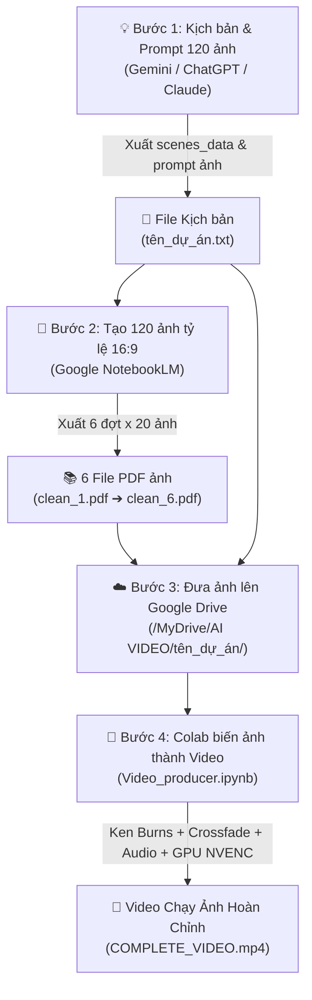

# 🎬 AI Video Producer - Tự Động Hóa Sản Xuất Video Dạng Chạy Ảnh (Ken Burns Storytelling)

> [!NOTE]
> **ĐỊNH DẠNG VIDEO CỐT LÕI**: Đây là hệ thống tự động sản xuất **Video dạng chạy ảnh động kể chuyện (Image-Based Storytelling / Ken Burns Slideshow)**. 
> Toàn bộ video được tạo nên từ **120 bức ảnh tĩnh AI** được thổi hồn bằng các chuyển động điện ảnh (*Zoom in, Zoom out, Pan lia máy*) và chuyển cảnh mờ chồng (*Crossfade*), đồng bộ khớp từng mili-giây với giọng đọc AI chuyên nghiệp.

Hệ thống kết hợp quy trình khép kín: **LLM (ChatGPT/Claude/Gemini)** ➔ **NotebookLM (Sinh ảnh AI hàng loạt)** ➔ **Google Drive** ➔ **Google Colab (Dựng video chạy ảnh siêu tốc bằng GPU NVENC)**.

---

## ✨ Điểm Nổi Bật Của Định Dạng Video Chạy Ảnh

* 📸 **Biến Ảnh Tĩnh Thành Thước Phim Động (Ken Burns Effect):** Mỗi bức ảnh tĩnh được áp dụng hiệu ứng camera giả lập bằng OpenCV C++ (phóng to, thu nhỏ, quét ngang, lia dọc), loại bỏ cảm giác xem ảnh tĩnh nhàm chán.
* 🪄 **Chuyển Cảnh Mượt Mà (Crossfade & Fade):** Chuyển tiếp giữa 120 bức ảnh bằng hiệu ứng hòa tan mờ chồng (Crossfade) 0.5s và mờ đen (Fade to black) với video kết thúc (Outro).
* 🎙️ **Đồng Bộ Giọng Đọc & Thời Lượng Từng Ảnh:** Mỗi bức ảnh hiển thị chuẩn xác theo thời lượng câu đọc của AI (`edge-tts`), không bị lệch hình hay hụt tiếng.
* ⚡ **Tối Ưu Chi Phí & Tốc Độ:** Thay vì tốn kém chi phí render video AI (Runway, Sora...), hệ thống tạo video documentary/storytelling dài 15 phút với 120 hình ảnh chỉ trong **10–20 phút** trên Google Colab Free (T4 GPU).

---

## 📌 Sơ Đồ Quy Trình Tổng Quan (Pipeline)



---

## 📂 Cấu Trúc Thư Mục Chuẩn Trên Google Drive

Toàn bộ code trong [`Video_producer.ipynb`](./Video_producer.ipynb) được thiết kế để tự động quét 120 ảnh từ các file PDF và xuất video theo cấu trúc:

```text
MyDrive/
└── AI VIDEO/
    │
    ├── material/                                 <-- Thư mục tài nguyên dùng chung
    │   └── theend.mp4                            <-- Video outro/kết thúc (tùy chọn)
    │
    └── <SUB_FOLDER_NAME>/                        <-- Thư mục dự án cụ thể (Ví dụ: lion_social)
        │
        ├── <SUB_FOLDER_NAME>.txt                 <-- Kịch bản 120 scenes JSON (lion_social.txt)
        │
        ├── image/                                <-- [BẮT BUỘC]: Chứa 6 file PDF ảnh từ NotebookLM
        │   ├── clean_1.pdf                       <-- 20 ảnh minh họa Scenes 1 - 20
        │   ├── clean_2.pdf                       <-- 20 ảnh minh họa Scenes 21 - 40
        │   ├── clean_3.pdf                       <-- 20 ảnh minh họa Scenes 41 - 60
        │   ├── clean_4.pdf                       <-- 20 ảnh minh họa Scenes 61 - 80
        │   ├── clean_5.pdf                       <-- 20 ảnh minh họa Scenes 81 - 100
        │   └── clean_6.pdf                       <-- 20 ảnh minh họa Scenes 101 - 120
        │
        │── [CÁC THƯ MỤC TỰ ĐỘNG SINH RA KHI CHẠY CODE - KHÔNG CẦN TẠO TAY]:
        │
        ├── clean_image/                          <-- Nơi giải nén 120 ảnh tĩnh (1.jpg, 2.jpg... 120.jpg)
        ├── audio/                                <-- Nơi lưu full_narration_audio.mp3 & scenes_timed.json
        └── video/                                <-- Chứa video chạy ảnh cuối cùng: COMPLETE_VIDEO.mp4
```

> [!TIP]
> Các thư mục `clean_image/`, `audio/`, và `video/` sẽ **tự động được khởi tạo** khi chạy notebook, bạn chỉ cần chuẩn bị file `.txt` và thư mục `image/` chứa 6 file PDF.

---

## 📝 Chi Tiết 4 Bước Thực Hiện

### Bước 1: Tạo kịch bản kể chuyện & Prompt mô tả cho 120 ảnh
1. Mở một trong các công cụ AI: **ChatGPT**, **Claude**, hoặc **Gemini**.
2. Sao chép nội dung prompt mẫu: [`content&image_generator_prompt.txt`](./content&image_generator_prompt.txt).
3. Điền chủ đề video vào dòng cuối:
   ```text
   === [ĐIỀN Ý TƯỞNG / CHỦ ĐỀ CỦA BẠN VÀO ĐÂY] ===
   ```
4. AI sẽ xuất ra kịch bản dạng chuỗi 120 phân cảnh tương ứng với **120 bức ảnh cần tạo**:
   * **`SUB_FOLDER_NAME`**: Tên thư mục dự án (viết liền không dấu, ví dụ: `lion_social`).
   * **`scenes_data`**: Mảng JSON 120 scenes gồm câu dẫn chuyện (`script_en`) và câu prompt chi tiết để sinh bức ảnh tương ứng (`image_generation_prompt`).
5. Lưu kết quả thành file text: `<SUB_FOLDER_NAME>.txt` (ví dụ: `lion_social.txt`).

---

### Bước 2: Tạo 120 ảnh tỷ lệ 16:9 bằng NotebookLM
1. Truy cập [Google NotebookLM](https://notebooklm.google.com/) và tạo một Notebook mới.
2. Nạp file `<SUB_FOLDER_NAME>.txt` làm **Tài liệu nguồn (Source)**.
3. Mở file: [`prompt_notebooklm.txt`](./prompt_notebooklm.txt).
4. Gửi lần lượt 6 lệnh tạo ảnh (chia thành từng đợt 20 ảnh để đảm bảo hình ảnh nhất quán phong cách và đủ 100% không sót ảnh):

| Đợt tạo ảnh | Phân cảnh tương ứng | Tên file PDF sau khi tải về |
|:---:|:---:|:---|
| **Đợt 1** | Scenes 1 – 20 (20 ảnh) | `clean_1.pdf` |
| **Đợt 2** | Scenes 21 – 40 (20 ảnh) | `clean_2.pdf` |
| **Đợt 3** | Scenes 41 – 60 (20 ảnh) | `clean_3.pdf` |
| **Đợt 4** | Scenes 61 – 80 (20 ảnh) | `clean_4.pdf` |
| **Đợt 5** | Scenes 81 – 100 (20 ảnh) | `clean_5.pdf` |
| **Đợt 6** | Scenes 101 – 120 (20 ảnh) | `clean_6.pdf` |

> [!IMPORTANT]
> Tên file PDF phải đặt chuẩn: `clean_1.pdf`, `clean_2.pdf`, ..., `clean_6.pdf`. Mỗi file chứa đúng 20 ảnh tương ứng theo thứ tự.

---

### Bước 3: Đưa kịch bản và ảnh lên Google Drive
1. Mở **Google Drive**, tạo thư mục: `AI VIDEO`.
2. *(Tùy chọn)* Đặt video outro kết thúc vào: `AI VIDEO/material/theend.mp4`.
3. Tạo thư mục dự án theo `SUB_FOLDER_NAME` (ví dụ: `AI VIDEO/lion_social/`).
4. Tải các file vào:
   * File text kịch bản: `AI VIDEO/lion_social/lion_social.txt`.
   * Thư mục con `image/` chứa đủ 6 file PDF: `clean_1.pdf` đến `clean_6.pdf`.

---

### Bước 4: Chạy Notebook biến 120 ảnh thành Video hoàn chỉnh
1. Tải file [`Video_producer.ipynb`](./Video_producer.ipynb) lên Google Colab.
2. **Bật GPU T4 (Bắt buộc để dựng và render nhanh):**
   * Vào menu: **Runtime (Thời gian chạy)** ➔ **Change runtime type (Thay đổi loại thời gian chạy)**.
   * Tại **Hardware accelerator**: Chọn **T4 GPU** ➔ Bấm **Save (Lưu)**.
3. **Cập nhật tên dự án tại Cell 2:**
   ```python
   SUB_FOLDER_NAME = "lion_social"
   script_file_path = "/content/drive/MyDrive/AI VIDEO/lion_social/lion_social.txt"
   ```
4. **Chạy toàn bộ (Run All):**
   * Nhấn **Runtime** ➔ **Run all** (hoặc `Ctrl + F9`).
   * Cấp quyền truy cập Google Drive khi được yêu cầu.

---

## ⚙️ Cơ Chế Xử Lý Ảnh Thành Video Trong Code

| Giai đoạn | Cell | Cách thức biến ảnh thành video động |
|:---|:---:|:---|
| **Cấu hình GPU** | **Cell 4** | Kích hoạt FFmpeg NVIDIA NVENC (`h264_nvenc`) trên Colab để chuẩn bị xuất video bằng GPU. |
| **Tạo giọng đọc** | **Cell 6** | Đọc 120 câu kịch bản bằng Microsoft Neural Voice (`edge-tts`), đo lường chính xác thời lượng từng câu thoại. |
| **Bóc tách ảnh** | **Cell 8** | Trích xuất 120 ảnh gốc không nén từ 6 file PDF vào `clean_image/` thành `1.jpg` đến `120.jpg`. |
| **Đồng bộ thời gian** | **Cell 10** | Khớp thời lượng hiển thị của từng bức ảnh với đúng độ dài câu thoại tương ứng. |
| **Hiệu ứng chuyển động** | **Cell 12** | Áp dụng thuật toán Ken Burns (Zoom in 15%, Zoom out, Pan lia máy) và hòa trộn mờ chồng (Crossfade) trên từng bức ảnh bằng C++ OpenCV. |
| **Dựng & Render GPU** | **Cell 14** | Ghép chuỗi 120 ảnh chuyển động + Audio + Video Outro, xuất thẳng thành file MP4 bằng chip GPU NVENC. |

---

## 🎬 Thành Phẩm Đầu Ra

* **Định dạng:** Video hoàn thiện MP4 Full HD **1080p** (1920x1080), 24 FPS, bitrate 6 Mbps sắc nét.
* **Thời lượng:** ~15 đến 16 phút (tương ứng câu chuyện 120 ảnh).
* **Đường dẫn lưu trữ:**
  ```text
  /content/drive/MyDrive/AI VIDEO/<SUB_FOLDER_NAME>/video/COMPLETE_VIDEO.mp4
  ```
* **Tốc độ:** Render hoàn tất 120 phân cảnh chuyển động trong vòng **10 – 20 phút** trên GPU T4 của Google Colab Free.
