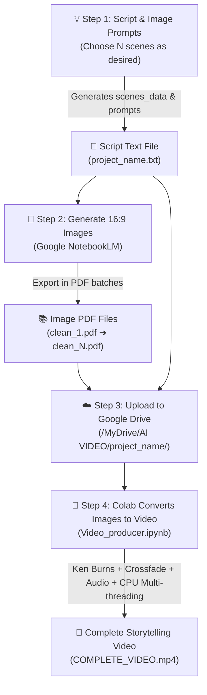

<div align="right">
  <strong>Language:</strong>
  <strong>🇺🇸 English</strong> |
  <a href="./README_VI.md">🇻🇳 Tiếng Việt</a>
</div>

# 🎬 AI Video Producer - Automated Image-Based Video Production (Ken Burns Storytelling)

> [!NOTE]
> **CORE VIDEO FORMAT**: This system automatically produces **Image-Based Storytelling / Ken Burns Slideshow Videos**.
> The entire video is composed of a **dynamic sequence of AI-generated still images (10, 30, 60, 120+ scenes — fully customizable)**, brought to life with cinematic camera motions (*Zoom in, Zoom out, Pan left/right/up*) and smooth crossfade transitions, synchronized millisecond-by-millisecond with professional AI voiceover narration.

The end-to-end automated pipeline connects: **LLMs (ChatGPT / Claude / Gemini)** ➔ **NotebookLM (Batch AI Image Generation)** ➔ **Google Drive** ➔ **Google Colab (Multi-Threaded CPU Video Rendering)**.

---

## ✨ Key Highlights of Image-Based Video Production

* 📸 **Transforming Still Images into Cinematic Shots (Ken Burns Effect):** Each static image is animated with smooth virtual camera motions using high-performance OpenCV C++ (zooming, panning), completely eliminating static presentation fatigue.
* 🪄 **Seamless Transitions (Crossfade):** Elegant 0.5s crossfade blends between sequential scenes for smooth, natural storytelling.
* 🔢 **Arbitrary & Dynamic Scene Count (No Fixed Limits):** Create short videos (10–20 images) or in-depth documentary videos (60, 100, 120+ images). The pipeline dynamically detects and calculates durations automatically.
* 🎙️ **Precise Audio-Visual Synchronization:** Each image duration is automatically aligned down to the millisecond with each sentence spoken by neural AI voiceover (`edge-tts`).
* ⚙️ **100% Reliable on Google Colab Free:** Fully decoupled from GPU dependencies or Colab GPU quotas. The rendering engine is optimized for multi-threaded CPU (`libx264`, `preset=veryfast`), ensuring consistent, uninterrupted completion on any free Colab account.

---

## 📌 Pipeline Architecture



---

## 📂 Google Drive Directory Structure

[`Video_producer.ipynb`](./Video_producer.ipynb) automatically scans all image PDF files in the `image/` directory and renders the video according to the following layout in `My Drive / AI VIDEO`:

```text
MyDrive/
└── AI VIDEO/
    │
    └── <SUB_FOLDER_NAME>/                        <-- Specific project folder (e.g., lion_social)
        │
        ├── <SUB_FOLDER_NAME>.txt                 <-- Script containing N scenes JSON (lion_social.txt)
        │
        ├── image/                                <-- [REQUIRED]: Image PDF files from NotebookLM
        │   ├── clean_1.pdf                       <-- 1st batch of images (e.g., scenes 1 - 20)
        │   ├── clean_2.pdf                       <-- 2nd batch of images (e.g., scenes 21 - 40)
        │   ├── clean_3.pdf                       <-- 3rd batch of images (e.g., scenes 41 - 60)
        │   └── ...                               <-- Add clean_4.pdf, clean_5.pdf... as needed
        │
        │── [DIRECTORIES CREATED AUTOMATICALLY BY CODE - DO NOT CREATE MANUALLY]:
        │
        ├── clean_image/                          <-- Extracted lossless raw images (1.jpg, 2.jpg... N.jpg)
        ├── audio/                                <-- Stores full_narration_audio.mp3 & scenes_timed.json
        └── video/                                <-- Final exported video: COMPLETE_VIDEO.mp4
```

> [!TIP]
> The `clean_image/`, `audio/`, and `video/` folders will be **automatically created** during execution. The system scans sequentially starting from `clean_1.pdf` onwards until all files are processed.

---

## 📝 Step-by-Step Guide

### Step 1: Generate Storytelling Script & Image Prompts
1. Open an LLM of your choice: **ChatGPT**, **Claude**, or **Gemini**.
2. Copy the template prompt from: [`content&image_generator_prompt.txt`](./content&image_generator_prompt.txt).
3. Specify your desired topic and **exact number of scenes** at the end (default is 120 scenes; you can request 20, 40, 60, 80, etc.):
   ```text
   === [ENTER YOUR TOPIC & NUMBER OF SCENES HERE] ===
   Example: Create a 40-scene storytelling script about the life of Nikola Tesla...
   ```
4. The AI will output a structured script:
   * **`SUB_FOLDER_NAME`**: Project folder identifier without special characters (e.g., `tesla_story`).
   * **`scenes_data`**: JSON array containing scene entries with narration (`script_en`) and prompt description (`image_generation_prompt`).
5. Save the entire result as a plain text file: `<SUB_FOLDER_NAME>.txt` (e.g., `tesla_story.txt`).

---

### Step 2: Generate 16:9 Images via NotebookLM
1. Visit [Google NotebookLM](https://notebooklm.google.com/) and create a new notebook.
2. Upload `<SUB_FOLDER_NAME>.txt` as a **Source document**.
3. Open the generation prompt guide: [`prompt_notebooklm.txt`](./prompt_notebooklm.txt).
4. **Batch Generation Rule:**
   * NotebookLM works most reliably when generating images in batches of **10 to 20 images per prompt**.
   * Run prompts in sequential batches and download the generated slide deck PDFs:

| Batch | Scene Range (Example) | PDF Download Filename |
|:---:|:---|:---|
| **Batch 1** | Images 1 to 20 | `clean_1.pdf` |
| **Batch 2** | Images 21 to 40 | `clean_2.pdf` |
| **Batch 3** | Images 41 to 60 | `clean_3.pdf` |
| **Batch ...**| Next batches until script completion | `clean_4.pdf`, `clean_5.pdf`... |

> [!IMPORTANT]
> **PDF Naming Convention:** PDFs must strictly follow sequential numbering: `clean_1.pdf`, `clean_2.pdf`, `clean_3.pdf`, `clean_4.pdf`... The code reads continuously starting from index 1 and **automatically terminates when no further PDF is found**.

---

### Step 3: Upload Files to Google Drive
1. On your **Google Drive**, create a root folder: `AI VIDEO`.
2. Create your project subfolder matching `SUB_FOLDER_NAME` (e.g., `AI VIDEO/tesla_story/`).
3. Upload files into their respective locations:
   * Script file: `AI VIDEO/tesla_story/tesla_story.txt`.
   * Create an `image` subfolder and place all PDF files inside: `clean_1.pdf`, `clean_2.pdf`...

---

### Step 4: Run Notebook on Google Colab (CPU Multi-threading)
1. Open [`Video_producer.ipynb`](./Video_producer.ipynb) in Google Colab.
2. **Configure Project Variables in Cell 2:**
   Update the folder name and script path to match your project:
   ```python
   SUB_FOLDER_NAME = "tesla_story"
   script_file_path = "/content/drive/MyDrive/AI VIDEO/tesla_story/tesla_story.txt"
   ```
3. **Execute All Cells (Run All):**
   * Click **Runtime** ➔ **Run all** (or press `Ctrl + F9`).
   * Grant Google Drive access permissions when prompted.
   * The notebook will run reliably on standard CPU multi-threading without GPU requirements.

---

## ⚙️ How the Code Transforms Images into Video

The processing pipeline automatically adapts to any quantity of images:

| Stage | Cell | Transformation Mechanism |
|:---|:---:|:---|
| **Hardware Setup** | **Cell 4** | Configures multi-threaded CPU rendering environment and installs core libraries. |
| **Voiceover Synthesis** | **Cell 6** | Synthesizes all narration sentences with Microsoft Neural Voice (`edge-tts`) and computes millisecond-precise timestamps. |
| **Lossless Extraction** | **Cell 8** | Loops through `clean_1.pdf`, `clean_2.pdf`... extracts raw full-resolution images into `clean_image/` (`1.jpg`, `2.jpg`...). |
| **Timing Alignment** | **Cell 10** | Dynamically locks each image's on-screen duration to its corresponding narration segment. |
| **Motion & Transitions** | **Cell 12** | Applies Ken Burns camera motion (15% zoom in, zoom out, directional pan) and 0.5s crossfade blends via C++ OpenCV. |
| **Assembly & CPU Render** | **Cell 14** | Composes all motion clips + audio, and exports the final MP4 using optimized multi-threaded CPU (`libx264`, `veryfast`). |

---

## 🎬 Output Deliverable

* **Video Format:** MP4 Full HD **1080p** (1920x1080), 24 FPS, high-clarity bitrate.
* **Duration:** Completely flexible depending on your scene count (from 1–2 minute shorts to 15–20+ minute documentaries).
* **Storage Location:**
  ```text
  /content/drive/MyDrive/AI VIDEO/<SUB_FOLDER_NAME>/video/COMPLETE_VIDEO.mp4
  ```
* **Reliability:** 100% reliable on Google Colab Free without GPU restrictions, quota limits, or disconnection risks.
