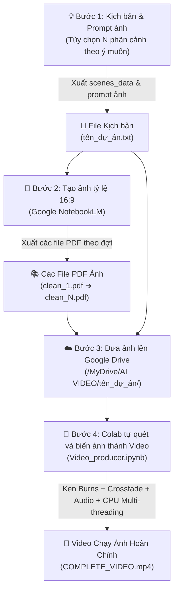

<div align="right">
  <strong>Language:</strong>
  <a href="./README.md">🇺🇸 English</a> |
  <strong>🇻🇳 Tiếng Việt</strong>
</div>

# 🎬 AI Video Producer - Tự Động Hóa Sản Xuất Video Dạng Chạy Ảnh (Ken Burns Storytelling)

> [!NOTE]
> **ĐỊNH DẠNG VIDEO CỐT LÕI**: Đây là hệ thống tự động sản xuất **Video dạng chạy ảnh động kể chuyện (Image-Based Storytelling / Ken Burns Slideshow)**. 
> Toàn bộ video được tạo nên từ **chuỗi ảnh tĩnh AI với số lượng linh hoạt tùy ý (10, 30, 60, 120+ ảnh...)**, được thổi hồn bằng các chuyển động điện ảnh (*Zoom in, Zoom out, Pan lia máy*) và chuyển cảnh mờ chồng (*Crossfade*), đồng bộ khớp từng mili-giây với giọng đọc AI chuyên nghiệp.

Hệ thống kết hợp quy trình khép kín: **LLM (ChatGPT/Claude/Gemini)** ➔ **NotebookLM (Sinh ảnh AI hàng loạt)** ➔ **Google Drive** ➔ **Google Colab (Dựng video chạy ảnh tối ưu đa luồng CPU)**.

---

## ✨ Điểm Nổi Bật Của Định Dạng Video Chạy Ảnh

* 📸 **Biến Ảnh Tĩnh Thành Thước Phim Động (Ken Burns Effect):** Mỗi bức ảnh tĩnh được áp dụng hiệu ứng camera giả lập bằng OpenCV C++ (phóng to, thu nhỏ, quét ngang, lia dọc), loại bỏ cảm giác xem ảnh tĩnh nhàm chán.
* 🪄 **Chuyển Cảnh Mượt Mà (Crossfade):** Chuyển tiếp giữa các bức ảnh bằng hiệu ứng hòa tan mờ chồng (Crossfade) 0.5s mượt mà, tự nhiên.
* 🔢 **Tùy Biến Số Lượng Phân Cảnh (Không Giới Hạn):** Bạn có thể làm video ngắn (10–20 ảnh) hoặc video dài tài liệu (60, 100, 120+ ảnh). Code sẽ tự động nhận diện và tính toán thời lượng tương ứng.
* 🎙️ **Đồng Bộ Giọng Đọc & Thời Lượng Từng Ảnh:** Mỗi bức ảnh hiển thị chuẩn xác theo thời lượng câu đọc của AI (`edge-tts`), không bị lệch hình hay hụt tiếng.
* ⚙️ **Hoạt Động Ổn Định 100% Trên Colab Free:** Không phụ thuộc vào GPU, không lo hết hạn ngạch (quota) GPU của Colab. Hệ thống tối ưu hóa render bằng CPU đa luồng (`libx264`, `preset=veryfast`), chạy mượt mà trên mọi tài khoản Colab miễn phí.

---

## 📺 Video Hướng Dẫn Quy Trình

https://github.com/NgPcAnhh/Video_producer_automation/raw/main/workflow_overview_video.mp4

> 💡 *Nếu trình phát video không tự động tải, bạn có thể [bấm vào đây để xem hoặc tải video về](./workflow_overview_video.mp4).*

---

## 📌 Sơ Đồ Quy Trình Tổng Quan (Pipeline)



---

## 📂 Cấu Trúc Thư Mục Chuẩn Trên Google Drive

Toàn bộ code trong [`Video_producer.ipynb`](./Video_producer.ipynb) được thiết kế để tự động quét toàn bộ file PDF ảnh có trong thư mục `image/` và xuất video theo cấu trúc:

```text
MyDrive/
└── AI VIDEO/
    │
    └── <SUB_FOLDER_NAME>/                        <-- Thư mục dự án cụ thể (Ví dụ: lion_social)
        │
        ├── <SUB_FOLDER_NAME>.txt                 <-- Kịch bản chứa JSON N phân cảnh (lion_social.txt)
        │
        ├── image/                                <-- [BẮT BUỘC]: Chứa các file PDF ảnh từ NotebookLM
        │   ├── clean_1.pdf                       <-- Đợt ảnh thứ 1 (Ví dụ: ảnh 1 - 20)
        │   ├── clean_2.pdf                       <-- Đợt ảnh thứ 2 (Ví dụ: ảnh 21 - 40)
        │   ├── clean_3.pdf                       <-- Đợt ảnh thứ 3 (Ví dụ: ảnh 41 - 60)
        │   └── ...                               <-- Thêm clean_4.pdf, clean_5.pdf... tùy độ dài dự án
        │
        │── [CÁC THƯ MỤC TỰ ĐỘNG SINH RA KHI CHẠY CODE - KHÔNG CẦN TẠO TAY]:
        │
        ├── clean_image/                          <-- Nơi giải nén toàn bộ ảnh (1.jpg, 2.jpg... N.jpg)
        ├── audio/                                <-- Nơi lưu full_narration_audio.mp3 & scenes_timed.json
        └── video/                                <-- Chứa video kết xuất cuối cùng: COMPLETE_VIDEO.mp4
```

> [!TIP]
> Các thư mục `clean_image/`, `audio/`, và `video/` sẽ **tự động được tạo** khi chạy code. Hệ thống sẽ tự động quét tuần tự từ `clean_1.pdf` trở đi cho đến khi hết file thì thôi.

---

## 📝 Chi Tiết 4 Bước Thực Hiện

### Bước 1: Tạo kịch bản kể chuyện & Prompt ảnh
1. Mở một trong các công cụ AI: **ChatGPT**, **Claude**, hoặc **Gemini**.
2. Sao chép nội dung prompt mẫu: [`content&image_generator_prompt.txt`](./content&image_generator_prompt.txt).
3. Điền chủ đề và **số lượng phân cảnh bạn mong muốn** vào dòng cuối (mặc định là 120 scenes, bạn hoàn toàn có thể yêu cầu 20, 40, 60, 80 scenes tùy ý):
   ```text
   === [ĐIỀN Ý TƯỞNG / CHỦ ĐỀ & SỐ LƯỢNG SCENES CỦA BẠN VÀO ĐÂY] ===
   Ví dụ: Hãy tạo kịch bản 40 phân cảnh kể về cuộc đời của Nikola Tesla...
   ```
4. AI sẽ xuất ra kịch bản dạng chuỗi JSON:
   * **`SUB_FOLDER_NAME`**: Tên thư mục dự án (viết liền không dấu, ví dụ: `tesla_story`).
   * **`scenes_data`**: Mảng JSON chứa danh sách các cảnh gồm câu dẫn chuyện (`script_en`) và prompt ảnh tương ứng (`image_generation_prompt`).
5. Lưu kết quả thành file text: `<SUB_FOLDER_NAME>.txt` (ví dụ: `tesla_story.txt`).

---

### Bước 2: Tạo ảnh tỷ lệ 16:9 bằng NotebookLM
1. Truy cập [Google NotebookLM](https://notebooklm.google.com/) và tạo một Notebook mới.
2. Nạp file `<SUB_FOLDER_NAME>.txt` làm **Tài liệu nguồn (Source)**.
3. Mở file: [`prompt_notebooklm.txt`](./prompt_notebooklm.txt).
4. **Quy tắc tạo ảnh linh hoạt theo đợt (Batching):**
   * NotebookLM tạo ảnh ổn định và chuẩn xác nhất khi chia theo từng đợt **khoảng 10 đến 20 ảnh/lần**.
   * Bạn tạo bao nhiêu ảnh thì chia bấy nhiêu đợt tương ứng và tải các file PDF về:

| Đợt tạo ảnh | Khoảng phân cảnh (Ví dụ mẫu) | Tên file PDF sau khi tải về |
|:---:|:---|:---|
| **Đợt 1** | Ảnh từ 1 đến 20 | `clean_1.pdf` |
| **Đợt 2** | Ảnh từ 21 đến 40 | `clean_2.pdf` |
| **Đợt 3** | Ảnh từ 41 đến 60 | `clean_3.pdf` |
| **Đợt ...**| Ảnh tiếp theo cho đến hết kịch bản | `clean_4.pdf`, `clean_5.pdf`... |

> [!IMPORTANT]
> **Quy tắc đặt tên file PDF:** Bắt buộc đặt tên theo thứ tự nối tiếp: `clean_1.pdf`, `clean_2.pdf`, `clean_3.pdf`, `clean_4.pdf`... Code trong notebook sẽ tự động đọc lần lượt từ file số 1 và **tự động dừng khi hết file**.

---

### Bước 3: Đưa kịch bản và ảnh lên Google Drive
1. Mở **Google Drive**, tạo thư mục gốc: `AI VIDEO`.
2. Tạo thư mục dự án theo `SUB_FOLDER_NAME` (ví dụ: `AI VIDEO/tesla_story/`).
3. Tải các file vào:
   * File text kịch bản: `AI VIDEO/tesla_story/tesla_story.txt`.
   * Thư mục con `image/` chứa các file PDF đã tạo: `clean_1.pdf`, `clean_2.pdf`...

---

### Bước 4: Chạy Notebook biến chuỗi ảnh thành Video hoàn chỉnh
1. Tải file [`Video_producer.ipynb`](./Video_producer.ipynb) lên Google Colab.
2. **Cập nhật tên dự án tại Cell 2:**
   Chỉ cần sửa tên dự án và đường dẫn file kịch bản tương ứng:
   ```python
   SUB_FOLDER_NAME = "tesla_story"
   script_file_path = "/content/drive/MyDrive/AI VIDEO/tesla_story/tesla_story.txt"
   ```
3. **Chạy toàn bộ (Run All):**
   * Nhấn **Runtime (Thời gian chạy)** ➔ **Run all (Chạy tất cả)** (hoặc phím tắt `Ctrl + F9`).
   * Cấp quyền truy cập Google Drive khi popup xuất hiện.
   * Notebook sẽ tự động chạy mượt mà bằng CPU đa luồng mà không cần GPU.

---

## ⚙️ Cơ Chế Xử Lý Ảnh Thành Video Trong Code

Hệ thống hoàn toàn **tự động thích ứng với số lượng ảnh bạn cung cấp**:

| Giai đoạn | Cell | Cách thức biến chuỗi ảnh thành video |
|:---|:---:|:---|
| **Cấu hình hệ thống** | **Cell 4** | Cấu hình môi trường đa luồng CPU và cài đặt các thư viện cần thiết. |
| **Tạo giọng đọc** | **Cell 6** | Đọc toàn bộ các câu trong kịch bản bằng Microsoft Neural Voice (`edge-tts`), tự đo lường chính xác thời lượng từng câu thoại. |
| **Bóc tách ảnh** | **Cell 8** | Tự động quét vòng lặp tất cả các file `clean_1.pdf`, `clean_2.pdf`... cho đến hết, bóc tách toàn bộ ảnh gốc không nén vào `clean_image/` thành `1.jpg`, `2.jpg`... |
| **Đồng bộ thời gian** | **Cell 10** | Khớp thời lượng hiển thị của từng bức ảnh với đúng độ dài câu thoại tương ứng. |
| **Hiệu ứng chuyển động** | **Cell 12** | Áp dụng thuật toán Ken Burns (Zoom in 15%, Zoom out, Pan lia máy) và hòa trộn mờ chồng (Crossfade) trên từng bức ảnh bằng C++ OpenCV. |
| **Dựng & Render CPU** | **Cell 14** | Ghép toàn bộ chuỗi ảnh chuyển động + Audio, xuất trực tiếp thành file MP4 bằng CPU đa luồng tối ưu (`veryfast`). |

---

## 🎬 Thành Phẩm Đầu Ra

* **Định dạng:** Video MP4 Full HD **1080p** (1920x1080), 24 FPS, bitrate chuẩn sắc nét.
* **Thời lượng:** Tùy biến linh hoạt theo số lượng phân cảnh của bạn (từ video ngắn 1–2 phút cho đến video dài 15–20+ phút).
* **Đường dẫn lưu trữ:**
  ```text
  /content/drive/MyDrive/AI VIDEO/<SUB_FOLDER_NAME>/video/COMPLETE_VIDEO.mp4
  ```
* **Tính ổn định:** Chạy 100% ổn định trên mọi tài khoản Google Colab Free mà không lo bị ngắt kết nối hay hết quota GPU.
